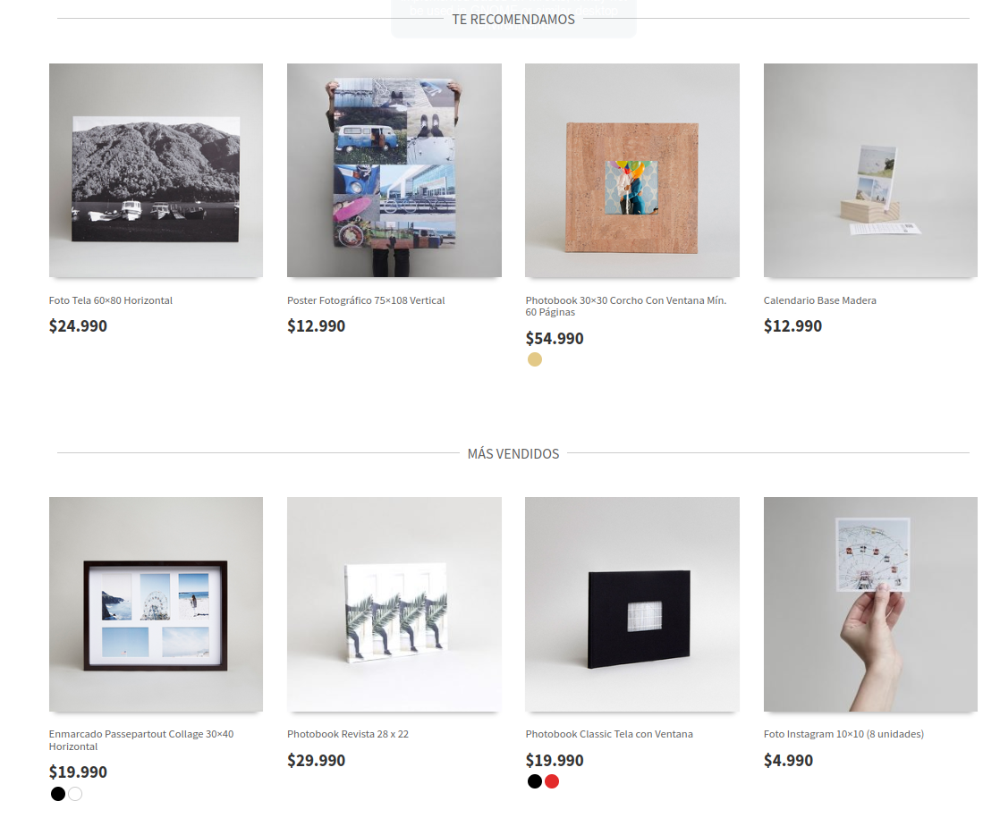
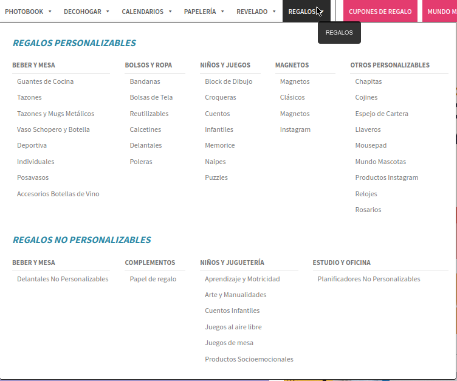

# Tarea 2: Heurísticas de Nielsen

| Integrantes   |        |        |     |     |
| ------------- | ------ | ------ | --- | --- |
| Estudiante 1: | Martín | Abbott |     |     |
| Estudiante 2: | Julio  | Cerda  |     |     |
| Estudiante 3: | José   | Llanos |     |     |

## Heuristícas de Nielsen aplicadas a las aplicaciones

Describa brevemente un ejemplo de cumplimiento y uno de incumplimiento de las distintas heurísticas de Nielsen si existen dichos ejemplos de la aplicación Web de [Emotions.cl](https://emotions.cl/). Si no existen ejemplos de cumplimiento o incumplimiento indicarlo y argumentar el por qué no existe dicho ejemplo. La solución a la tarea se debe entregar en un documento Markdnown subido al repositorio Git del grupo en el [Gitlab de Informática](https://gitlab.inf.utfsm.cl/). Es posible utilizar pantallazos en el documento Markdown ya que el contenido se renderiza automáticamente en HTML de forma correcta.

1. Consistencia y estándares 
   
   * Ejemplos positivos
     
     Como la mayoría de páginas de tiendas, esta tienda también muestra productos importantes en la página principal, lo que ayuda a tener una idea del tipo de productos que se venden.
     
     Además, hay una clara diferenciación en los textos entre los hipervínculo y el texto normal
     
     
   
   * Ejemplos negativos
     
     No se encuentran. La página cumple un proposito bastante simple y es bastante generica por lo que es dificil encontrar fallos de consistencia o estandares.

2. Visibilidad del estado del sistema
   
   * Ejemplos positivos
     
     Cuando se hace click en los botones, estos realizan una animación simulando ser presionado, haciendole saber al usuario que este fue presionado.
     
     [Botón ejemplo "CREAR"](https://emotions.cl/producto/foto-tela-60x80-horizontal/)
   
   * Ejemplos negativos
     
     Cuando cargan las imagenes de los productos no muestra que se están cargando, podría agregarse una animación que represente este estado.

3. Similitud entre el sistema y el mundo real
   
   * Ejemplos positivos
     
     No se usa un lenguaje técnico en los productos ni en sus descripciones, haciendo que sea una experiencia similar al mundo real.
     
     
   
   * Ejemplos negativos
     
     No se presentan. Ya que cumple con que los productos y sus descripciones se asemejen a la realidad, junto con el resto de la aplicación.

4. Control de usuario y libertad
   
   * Ejemplos positivos
     
     En todos los otros modales o ventanas emergentes (a excepción del mencionado debeja) existe la opciones de regresar con la misma interfaz.
     
     Además, no aparecen pop-up de publicidad o problemas con el adblock.
     
     
   
   * Ejemplos negativos
     
     Al entrar al carro de compras pide iniciar sesion y no existe una "salida de emergencia" para regresar en la interfaz, no dejando más opción que regresar con el navegador (no sale "cruz" para quitar el modal).
     
     
     
     [Carro de Compras - Emotions](https://emotions.cl/carro-de-compras/)

5. Reconocimiento más que recuerdo
   
   * Ejemplos positivos
     
     El flujo de selección de un producto es intuitivo, ya que no sólo tiene el nombre del producto con sus características generales, también imágenes.
     
     
   
   * Ejemplos negativos
     
     Por cada categoría de productos hay muchas subcategorías, haciendo dificil encontrar como llegar a un objeto/producto en especifico.
     
     

6. Prevención del error
   
   * Ejemplos positivos
     
     Al crear una cuenta, al usuario se le pide repetir la contraseña, así se disminuye la probabilidad que el usuario ingrese su nueva contraseña con algún error de tipeo.
     
     
   
   * Ejemplos negativos
     
     Al querer ver el carrito de compras se abre un modal el cual no se puede quitar haciendo uso de la interfaz. Podría haber una advertencia de esta situación.
     
     

7. Ayuda al usuario en reconocer, diagnosticar y recuperarse del error
   
   * Ejemplos positivos
     
     Al ir al carrito de compras e ingresar un e-mail sin el signo @, aparecerá un mensaje que indica que se debe incluir el signo @ en la dirección de correo electrónico.
     
     
   
   * Ejemplos negativos
     
     No hay. Dado que, no existen muchos casos de errores detectados, por lo que no habrá recuperación de errores.

8. Flexibilidad y eficiencia de uso
   
   * Ejemplos positivos
     
     Para los usuarios que hayan marcado como favoritos productos que les haya gustado con el ícono de corazón, luego pueden acceder a estos rápidamente a través de apretar el ícono de corazón que aparece en la frontpage, ahorrándose acciones para acceder a estos.
     
     
     
     
   
   * Ejemplos negativos
     
     No hay recomendados en base a lo que suele buscar un usuario.

9. Diseño estético y minimalista
   
   * Ejemplos positivos
     
     En la frontpage, al bajar un poco, se muestran los productos más vendidos y recomendados, los cuales se denotan claramente para poder seleccionar y ocupan la totalidad de la pantalla para que tengan énfasis y no distraer al usuario con otra información.
     
     
   
   * Ejemplos negativos
     
     Al principio de la página principal, inmediatamente se puede observar una gran cantidad de información y opciones disponibles de manera compacta, como el registro, compra, categorías de productos, información de descuentos, etc., lo cual puede ser abrumador para un usuario nuevo o que haya ocupado pocas veces la página web
     
     

10. Ayuda y documentación
    
    * Ejemplos positivos
      
      Presenta una sección de [ayuda](https://ayuda.emotions.cl/hc/es/articles/202573399--Como-agregar-una-fecha-importante-en-mi-Calendario-de-Escritorio-o-Pared-) en como personalizar los productos haciendo uso de la página web.
      
      
    
    * Ejemplos negativos
      
      No se presentan, ya que al ser una simple tienda no tiene mucha ciencia su utilización ya que todo es super intuitivo.
